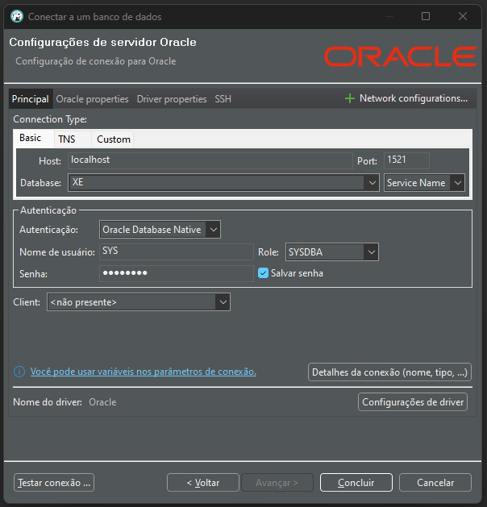

# Configuração do Oracle Compose

## Descrição
Esta configuração Docker Compose permite executar um contêiner Oracle XE (Express Edition) usando a imagem gvenzl/oracle-xe. O contêiner Oracle XE expõe a porta 1521 para conexões com o banco de dados. Além disso, a senha admin123 é definida para o banco de dados Oracle durante a inicialização do contêiner.

## Pré-requisitos
Docker instalado no seu sistema
Conhecimento básico do Docker Compose

## Uso
#### Clone o repositório:
    git clone https://github.com/Adrianogvs/003_Docker_Compose-_Projects.git
    cd 003_Docker_Compose-_Projects/BancoDados/Oracle

#### Crie um volume Docker para os dados do Oracle:
    docker volume create oracle-volume

#### Execute o contêiner Oracle XE usando o Docker Compose:
    docker-compose up -d

#### Verifique os contêineres em execução:
    docker ps

A saída deve exibir o contêiner Oracle XE em execução.

#### Conecte-se ao contêiner Oracle XE usando uma ferramenta como DBeaver ou SQL*Plus com os seguintes detalhes de conexão:

    Host: localhost
    Porta: 1521
    SID: XE
    Nome de usuário: system
    Senha: admin123

#### Após o uso, pare e remova os contêineres:
    docker-compose down

## Detalhes da Configuração

Arquivo Docker Compose (docker-compose.yml)
    yaml
    Copy code
    version: '3'

    services:
    oracle-xe:
        image: gvenzl/oracle-xe:latest
        ports:
        - "1521:1521"
        environment:
        - ORACLE_PASSWORD="admin123"
        volumes:
        - oracle-volume:/opt/oracle/oradata

    volumes:
    oracle-volume:

* O serviço oracle-xe utiliza a imagem gvenzl/oracle-xe:latest.
* A porta 1521 no host é mapeada para a porta 1521 no contêiner para conexões com o banco de dados.
* A variável de ambiente ORACLE_PASSWORD é configurada como "admin123" para o banco de dados Oracle.
* Um volume Docker chamado oracle-volume é usado para persistir os dados do Oracle.

## Configuração do DBeaver

Use os seguintes detalhes de conexão ao configurar o DBeaver ou uma ferramenta semelhante:

URL de Conexão ao Banco de Dados: jdbc:oracle:thin:@localhost:1521:XE
Nome de Usuário: system
Senha: admin123
Capturas de Tela
Inclua capturas de tela, se houver, para demonstrar o início bem-sucedido do contêiner ou conexões com o banco de dados.

Observação: A senha fornecida (admin123) é apenas para fins de demonstração. Substitua-a por uma senha segura em um ambiente de produção.